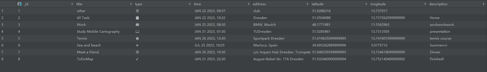

# ToDoMap

An map-based app with to do list to manage your life easily.

Group Member: Jiapan Wang, Zihan Liu

## 1. Introduction

Have you ever experienced that when you have a lot of tasks to do but you don’t know which one to start and how to plan your daily journey? Have you ever experienced that when you want to search the location of your next work place but you have to switch different apps and copy paste many times? Here is why our **ToDoMap** comes out. This application aims to help users manage their work and life easily by visualizing todo tasks on a map.

This app is the course project of the **Mobile Cartography** course within the framework of [Cartography M.Sc.](https://cartographymaster.eu/) Programme.

## 2. Target Groups

**ToDoMap** is an app for all user groups. We provide seven types of task (all :clipboard:, work :briefcase:, study :book:, life :house:, travel :airplane:, other :globe_with_meridians: and done :heavy_check_mark:) which can fulfill most of demands of users.

Not only a todo management app **ToDoMap** is, but also a life record app it could be.

- If you are studying or working, you can use our app to manage your daily study, work, life, and other stuff.

- If you are doing a travel plan, you can use our app to mark the places you want to go beforehand or record the places you have been to afterwards.

- If you are a life record lover, you can use our app to record your daily life and post it at anyplace you want!

Give full play to your imagination to use **ToDoMap**, combine your daily life with maps, and make your life better!

## 3. Main Features

#### 3.1 Add Taks

#### 3.2 Task View

#### 3.3 Map View

#### 3.4 Settings View

## 4. Development

#### 4.1 Task SQLite Database

Here is the structure and datatype of SQLite database, which will be created locally on the device when user firstly install **ToDoMap**.

| _id                               | title         | type | time | address | latitude | longitude | description |
|-----------------------------------|---------------|------|------|---------|----------|-----------|-------------|
| INTEGER PRIMARY KEY AUTOINCREMENT | TEXT NOT NULL | TEXT | TEXT | TEXT    | DOUBLE   | DOUBLE    | TEXT        |

After tasks created, the data in database looks like:

#### 4.2 Fragment-based Bottom Navigation

The main activity of **ToDoMap** consists of three fragments (task view, map view, settings view), and uses a bottom navigation bar to manage different views. The app framework was shown in the following figure.

#### 4.3 Google Map Integration

**ToDoMap** implement the map view by [Google Maps SDK for Android](https://developers.google.com/maps/documentation/android-sdk/overview?section=tools), and implement the navigation by [OpenRouteService](https://openrouteservice.org/).

#### 4.3 Custom Design

**ToDoMap** provides different custom design that user can select, like app styles (light or dark), basemap (normal or satellite), map style (light or dark).

#### 4.4 Further Development

There are more features are expected to implement in the future.

- Sort/search tasks by time or address
- Custom task type and custom icon
- Task group view
- Better UI

## 5. Contribution

| Assignment      | Contributor   |
|-----------------|---------------|
| Database        | Jiapan        |
| App framework   | Jiapan, Zihan |
| Add/Modify task | Jiapan, Zihan |
| Map view        | Zihan         |
| Task view       | Jiapan        |
| Settings view   | Jiapan, Zihan |
| Icon design     | Zihan         |
| Map style       | Zihan         |
| App style       | Jiapan        |
